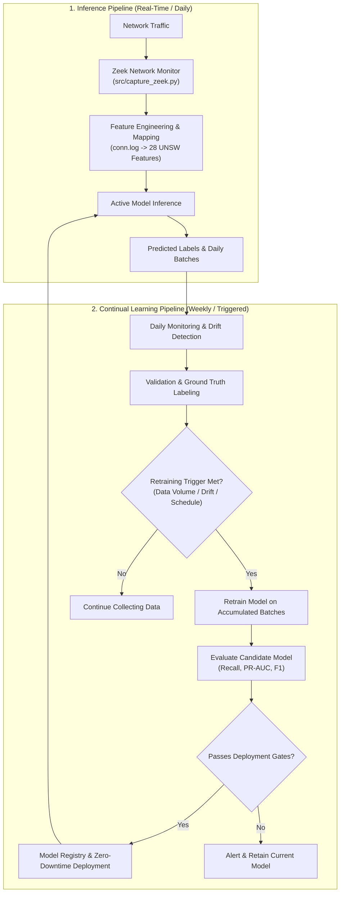

# 🛡️ Adaptive Network Intrusion Detection System (Adaptive NIDS) with Continual Model Retraining

> **MLOps Project**: Intrusion Detection System (IDS) Jaringan Adaptif dengan Menggunakan Pendekatan *Continual Model Retraining*.

---

## 📌 Project Overview

Digital infrastructure across public services, banking, government, and enterprise faces rapidly growing cyber threats such as network intrusions, malware, botnets, and DDoS attacks. According to the **National Cyber and Crypto Agency (BSSN) Indonesia (2024)**, over **330.5 million traffic anomalies** were monitored, with the **Mirai Botnet** representing the largest single anomaly category (~81.3 million activities).

Traditional machine learning and deep learning-based Network Intrusion Detection Systems (NIDS) are trained on static historical data. However, **network traffic characteristics and attack patterns evolve continuously**, leading to severe model degradation and concept drift over time.

### 💡 Proposed Solution
This project develops an **Adaptive AI-driven NIDS** integrated with an end-to-end **MLOps Continual Retraining Pipeline**:
- **Real-Time Data Capture**: Captures live network traffic at the session/application layer using **Zeek** (`src/capture_zeek.py`).
- **Continual Retraining Simulation**: Partitioning the **UNSW-NB15** benchmark dataset into sequential batches to simulate incoming data streams over time.
- **Automated Drift & Trigger Mechanism**: Monitors data distribution shifts and performance metrics. Retraining is triggered automatically upon reaching threshold drift levels or scheduled intervals.

---

## 📊 Dataset: UNSW-NB15

The model is trained and evaluated on the **UNSW-NB15** dataset, created by IXIA PerfectStorm at the Cyber Range Lab of the Australian Centre for Cyber Security (ACCS):
- **Total Records**: 2,540,044 network flow instances across 4 CSV files.
- **Features**: 49 raw attributes (packet-level, flow-level, and connection-level statistics).
- **Preprocessed Schema**: 28 features mapped to Zeek `conn.log` equivalents.
- **Attack Categories**: Contains 9 modern attack families (*Fuzzers, Analysis, Backdoors, DoS, Exploits, Generic, Reconnaissance, Shellcode, Worms*).
- **Classification Objective**: Binary classification (`Normal` vs. `Attack`), prioritizing high recall for attack detection.

---

## 🏗️ System Architecture & Pipelines

The system links real-time traffic monitoring via Zeek with an offline/continual retraining loop:



### 🎯 Key Evaluation Metrics

| Category | Metric | Objective |
| :--- | :--- | :--- |
| **Model Performance** | **Recall (Primary)** | Prioritize detecting true attacks and minimize false negatives. |
| | **F1-Score** | Balance precision and recall. |
| | **PR-AUC** | Robust evaluation for heavily imbalanced anomaly distributions. |
| **System Performance** | **Inference Latency** | Time taken to predict per batch/flow. |
| | **Throughput** | Number of network flows analyzed per second. |
| | **Retraining Duration** | Time required to retrain and validate candidate models. |
| **Continual Learning** | **Metric Delta ($\Delta$)** | Measure stability and adaptation of Recall, F1, and PR-AUC before vs. after retraining. |

---

## 📡 Live Traffic Capture with Zeek

The [`src/capture_zeek.py`](src/capture_zeek.py) script handles real-time packet capturing and generates session logs in `zeek_logs/`.

### Commands & Usage

1. **List Available Network Interfaces**:
   ```bash
   python3 src/capture_zeek.py --list-interfaces
   ```

2. **Capture Live Traffic (IPv4 Only)**:
   ```bash
   sudo python3 src/capture_zeek.py -i wlo1 -d 60 --ipv4-only
   ```

3. **Capture Traffic with Custom BPF Filter**:
   ```bash
   sudo python3 src/capture_zeek.py -i wlo1 -d 60 -f "ip"
   ```

> Output logs are saved in sequentially numbered directories under `zeek_logs/run_1/`, `zeek_logs/run_2/`, etc., with automatic ownership adjustment to non-root users.

---

## 🔄 Feature Mapping & Preprocessing

Zeek `conn.log` streams are mapped to UNSW-NB15 features using the rules defined in [`zeek_unsw_mapping.json`](zeek_unsw_mapping.json) and documented in [`zeek_unsw_feature_mapping.md`](zeek_unsw_feature_mapping.md):

- **Direct Mappings**: `id.orig_h` $\rightarrow$ `srcip`, `id.orig_p` $\rightarrow$ `sport`, `id.resp_h` $\rightarrow$ `dstip`, `id.resp_p` $\rightarrow$ `dsport`, `duration` $\rightarrow$ `dur`, `orig_bytes` $\rightarrow$ `sbytes`, `resp_bytes` $\rightarrow$ `dbytes`, etc.
- **Derived Features**: `Sload`, `Dload`, `smeansz`, `dmeansz`, `Ltime`, and `is_sm_ips_ports`.
- **Rolling Window Aggregations (`ct_*`)**: Computes 8 contextual features over a 100-connection rolling window (`ct_srv_src`, `ct_dst_ltm`, `ct_src_dport_ltm`, etc.).
- **Hex Port Parsing**: Handles raw hexadecimal port representations (`0x000b`, `0xcc09`, etc.) found in raw datasets (`parse_port`).

For full preprocessing documentation and diagram, see [`preprocessing_summary.txt`](preprocessing_summary.txt) and [`pipeline_architecture.md`](pipeline_architecture.md).

---

## 🚀 Setup & Installation Guide

### Prerequisites
- **Python 3.11+**
- **Zeek Network Security Monitor** (for live traffic capture)
- **Git**

---

### Option A: Local Setup (Windows / macOS / Linux)

1. **Clone the Repository**:
   ```bash
   git clone https://github.com/xx-bot/MLOps-AdaptiveNIDS.git
   cd MLOps-AdaptiveNIDS
   ```

2. **Create and Activate Virtual Environment**:
   ```bash
   python3 -m venv .venv
   source .venv/bin/activate
   ```

3. **Install Dependencies**:
   ```bash
   pip install --upgrade pip
   pip install -r requirements.txt
   ```

4. **Launch Jupyter Environment**:
   ```bash
   jupyter lab
   ```

---

### Option B: GitHub Codespaces

1. Navigate to [`xx-bot/MLOps-AdaptiveNIDS`](https://github.com/xx-bot/MLOps-AdaptiveNIDS).
2. Click **`<> Code`** > **`Codespaces`** > **`Create codespace on main`**.
3. Select a machine with at least **4 cores / 16 GB RAM** for processing raw CSV datasets.

---

## 💾 Dataset Management

The raw **UNSW-NB15** CSV files exceed GitHub's single-file size limits and are excluded from Git via [`.gitignore`](.gitignore).

Place raw dataset files inside the `data/raw/` directory:

```text
data/
├── raw/
│   ├── NUSW-NB15_features.csv
│   ├── UNSW-NB15_1.csv
│   ├── UNSW-NB15_2.csv
│   ├── UNSW-NB15_3.csv
│   ├── UNSW-NB15_4.csv
│   ├── UNSW-NB15_LIST_EVENTS.csv
│   ├── UNSW_NB15_testing-set.csv
│   └── UNSW_NB15_training-set.csv
└── processed/
```

---

## 📁 Repository Structure

```text
MLOps-AdaptiveNIDS/
├── .devcontainer/
│   └── devcontainer.json             # Codespaces container configuration
├── data/
│   ├── raw/                          # Raw UNSW-NB15 CSV files (gitignored)
│   └── processed/                    # Processed dataset storage
├── models/                           # Trained model artifacts & checkpoints
├── notebook/
│   └── notebook.ipynb                # EDA, preprocessing & feature engineering
├── src/
│   └── capture_zeek.py               # Real-time traffic capture script using Zeek
├── zeek_logs/                        # Captured Zeek session logs (run_1, run_2...)
├── zeek_unsw_mapping.json            # JSON schema mapping Zeek conn.log to UNSW-NB15
├── zeek_unsw_feature_mapping.md      # Detailed Zeek to UNSW feature mapping guide
├── preprocessing_summary.txt         # Preprocessing steps summary
├── pipeline_architecture.md          # Preprocessing pipeline diagram (Mermaid)
├── .gitignore                        # Excludes virtual environments and raw dataset
├── requirements.txt                  # Python dependencies
├── LICENSE                           # Project license
└── README.md                         # Project documentation
```

---

## 👥 Contributors & Acknowledgements

- **Author**: Alexander Angelo ([@xx-bot](https://github.com/xx-bot))
- **Course**: MLOps (Semester 5)
- **Supervisor**: Rizal Setya Perdana, S.Kom., M.Kom., Ph.D.
