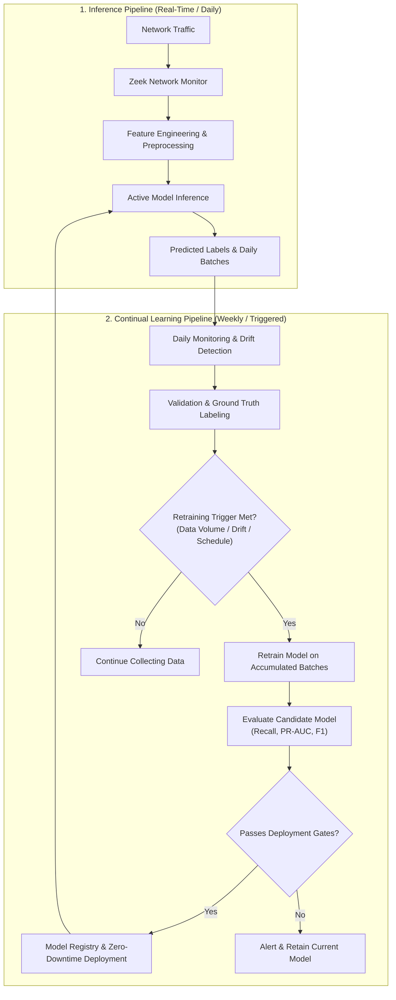

# 🛡️ Adaptive Network Intrusion Detection System (Adaptive NIDS) with Continual Model Retraining

> **MLOps Project**: Intrusion Detection System (IDS) Jaringan Adaptif dengan Menggunakan Pendekatan *Continual Model Retraining*.

---

## 📌 Project Overview

Digital infrastructure across public services, banking, government, and enterprise faces rapidly growing cyber threats such as network intrusions, malware, botnets, and DDoS attacks. According to the **National Cyber and Crypto Agency (BSSN) Indonesia (2024)**, over **330.5 million traffic anomalies** were monitored, with the **Mirai Botnet** representing the largest single anomaly category (~81.3 million activities).

Traditional machine learning and deep learning-based Network Intrusion Detection Systems (NIDS) are trained on static historical data. However, **network traffic characteristics and attack patterns evolve continuously**, leading to severe model degradation and concept drift over time.

### 💡 Proposed Solution
This project develops an **Adaptive AI-driven NIDS** integrated with an end-to-end **MLOps Continual Retraining Pipeline**:
- **Real-Time Data Capture**: In deployment, network traffic is captured at the session/application layer using **Zeek**.
- **Continual Retraining Simulation**: During development, the **UNSW-NB15** dataset is partitioned into sequential batches to simulate incoming data streams over time.
- **Automated Drift & Trigger Mechanism**: The system monitors data distribution shifts and performance metrics daily. When threshold triggers or scheduled weekly intervals are reached, the system automatically triggers model retraining and redeploys the updated model.

---

## 📊 Dataset: UNSW-NB15

The model is trained and evaluated on the **UNSW-NB15** dataset, created by IXIA PerfectStorm at the Cyber Range Lab of the Australian Centre for Cyber Security (ACCS):
- **Total Records**: 2,540,044 network flow instances.
- **Features**: 49 attributes (packet-level, flow-level, and connection-level statistics).
- **Attack Categories**: Contains 9 modern attack families (*Fuzzers, Analysis, Backdoors, DoS, Exploits, Generic, Reconnaissance, Shellcode, Worms*).
- **Classification Objective**: Binary classification (`Normal` vs. `Attack`), prioritizing the identification of malicious network activity.

---

## 🏗️ System Architecture & Pipelines

The system is structured around two interconnected pipelines:



### 🎯 Key Evaluation Metrics

| Category | Metric | Objective |
| :--- | :--- | :--- |
| **Model Performance** | **Recall (Primary)** | Prioritize detecting true attacks and minimize false negatives. |
| | **F1-Score** | Balance precision and recall. |
| | **PR-AUC** | Robust evaluation for heavily imbalanced anomaly distributions. |
| **System Performance** | **Inference Latency** | Time taken to predict per batch/flow. |
| | **Throughput** | Number of network flows analyzed per second. |
| | **Retraining Duration** | Time required to retrain and validate candidate models. |
| **Continual Learning** | **Metric Delta ($\Delta$)** | Measure stability and adaptation of Recall, F1, and PR-AUC before vs. after retraining. |

---

## 🚀 Setup & Installation Guide

You can run this project either on **GitHub Codespaces (cloud)** or **locally on your machine**.

---

### Option A: GitHub Codespaces (Recommended)

GitHub Codespaces provides a pre-configured, containerized Linux environment with Python 3.11, Jupyter, and all extensions pre-installed.

1. **Launch Codespace**:
   - Go to the repository on GitHub: [`xx-bot/MLOps-AdaptiveNIDS`](https://github.com/xx-bot/MLOps-AdaptiveNIDS).
   - Click the green **`<> Code`** button, select the **`Codespaces`** tab, and click **`Create codespace on main`**.
   - *(Recommended machine size)*: Click the three dots `...` > **New with options** and select a machine with at least **4 cores / 16 GB RAM** to handle loading large CSV datasets into memory.

2. **Automatic Environment Build**:
   - Codespaces reads [`.devcontainer/devcontainer.json`](.devcontainer/devcontainer.json).
   - It will automatically install Python 3.11, the VS Code Python & Jupyter extensions, and run `pip install -r requirements.txt`.

3. **Updating / Rebuilding an Existing Codespace**:
   - If your Codespace is already open, pull latest changes and rebuild:
     ```bash
     git pull
     ```
   - Press `Ctrl + Shift + P` (or `Cmd + Shift + P` on macOS), type **`Codespaces: Rebuild Container`**, and press Enter.

4. **Running Notebooks**:
   - Open [`notebook/notebook.ipynb`](notebook/notebook.ipynb).
   - In the top-right kernel picker, choose **Python 3.11 (Python Environments / Dev Container)**.

---

### Option B: Local Setup (Windows / macOS / Linux)

#### Prerequisites
- **Python 3.11+** installed
- **Git** installed

#### 1. Clone the Repository
```bash
git clone https://github.com/xx-bot/MLOps-AdaptiveNIDS.git
cd MLOps-AdaptiveNIDS
```

#### 2. Create and Activate a Virtual Environment

- **Using standard `venv`**:
  - **Windows (PowerShell)**:
    ```powershell
    python -m venv .venv
    .\.venv\Scripts\Activate.ps1
    ```
  - **macOS / Linux**:
    ```bash
    python3 -m venv .venv
    source .venv/bin/activate
    ```

- **Using `uv` (Faster)**:
  ```bash
  uv venv --python 3.11
  # Windows
  .\.venv\Scripts\activate
  # Linux/macOS
  source .venv/bin/activate
  ```

#### 3. Install Dependencies
```bash
pip install --upgrade pip
pip install -r requirements.txt
```

#### 4. Launch Jupyter Notebook / Lab
```bash
jupyter lab
# or
jupyter notebook
```


---

## 💾 Dataset Management

Because the full **UNSW-NB15** CSV files exceed 100 MB each (e.g., `UNSW-NB15_1.csv` ~168 MB), large dataset files are excluded from Git version control via [`.gitignore`](.gitignore) to respect GitHub's upload limits.

### Placing the Dataset Files
Download the dataset from [Kaggle: UNSW-NB15](https://www.kaggle.com/datasets/mrwellsdavid/unsw-nb15) and place the CSV files inside the `dataset/raw/` directory:

```text
dataset/
└── raw/
    ├── NUSW-NB15_features.csv
    ├── UNSW-NB15_1.csv
    ├── UNSW-NB15_2.csv
    ├── UNSW-NB15_3.csv
    ├── UNSW-NB15_4.csv
    ├── UNSW-NB15_LIST_EVENTS.csv
    ├── UNSW_NB15_testing-set.csv
    └── UNSW_NB15_training-set.csv
```

---

## 📁 Repository Structure

```text
MLOps-AdaptiveNIDS/
├── .devcontainer/
│   └── devcontainer.json        # Codespaces container configuration
├── dataset/
│   └── raw/                     # Raw UNSW-NB15 CSV files (gitignored)
├── notebook/
│   └── notebook.ipynb           # EDA, preprocessing & model development
├── .gitignore                   # Excludes virtual environments and large datasets
├── requirements.txt             # Python dependencies
├── LICENSE                      # Project license
└── README.md                    # Project documentation & setup guides
```

---

## 👥 Contributors & Acknowledgements
- **Author**: Alexander Angelo ([@xx-bot](https://github.com/xx-bot))
- **Course**: MLOps (Semester 5)
- **Supervisor**: Rizal Setya Perdana, S.Kom., M.Kom., Ph.D.
