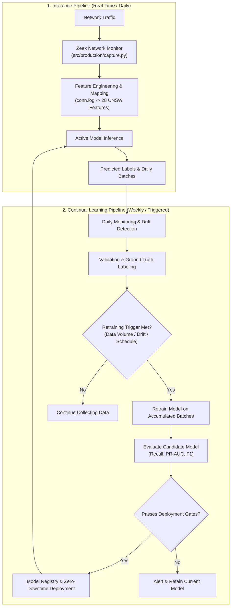

# 🛡️ Adaptive Network Intrusion Detection System (Adaptive NIDS) with Continual Model Retraining

> **MLOps Project**: Intrusion Detection System (IDS) Jaringan Adaptif dengan Menggunakan Pendekatan *Continual Model Retraining*.

---

## 📌 Project Overview

Digital infrastructure across public services, banking, government, and enterprise faces rapidly growing cyber threats such as network intrusions, malware, botnets, and DDoS attacks. According to the **National Cyber and Crypto Agency (BSSN) Indonesia (2024)**, over **330.5 million traffic anomalies** were monitored, with the **Mirai Botnet** representing the largest single anomaly category (~81.3 million activities).

Traditional machine learning and deep learning-based Network Intrusion Detection Systems (NIDS) are trained on static historical data. However, **network traffic characteristics and attack patterns evolve continuously**, leading to severe model degradation and concept drift over time.

### 💡 Proposed Solution
This project develops an **Adaptive AI-driven NIDS** integrated with an end-to-end **MLOps Continual Retraining Pipeline**:
- **Real-Time Data Capture**: Captures live network traffic at the session/application layer using **Zeek** ([`src/production/capture.py`](file:///home/alex/Documents/mlops/MLOps-AdaptiveNIDS/src/production/capture.py)).
- **Continual Retraining Simulation**: Partitioning the **UNSW-NB15** benchmark dataset into sequential batches to simulate incoming data streams over time ([`src/simulation/simulate_stream.py`](file:///home/alex/Documents/mlops/MLOps-AdaptiveNIDS/src/simulation/simulate_stream.py)).
- **Automated Drift & Trigger Mechanism**: Monitors data distribution shifts and performance metrics. Retraining is triggered automatically upon reaching threshold drift levels or scheduled intervals.

---

## 📊 Dataset: UNSW-NB15

The model is trained and evaluated on the **UNSW-NB15** dataset, created by IXIA PerfectStorm at the Cyber Range Lab of the Australian Centre for Cyber Security (ACCS):
- **Total Records**: 2,540,044 network flow instances across 4 CSV files.
- **Features**: 49 raw attributes (packet-level, flow-level, and connection-level statistics).
- **Preprocessed Schema**: 28 features mapped to Zeek `conn.log` equivalents.
- **Attack Categories**: Contains 9 modern attack families (*Fuzzers, Analysis, Backdoors, DoS, Exploits, Generic, Reconnaissance, Shellcode, Worms*).
- **Classification Objective**: Binary classification (`Normal` vs. `Attack`), prioritizing high recall for attack detection.

---

## 🏗️ System Architecture & Pipelines

The system links real-time traffic monitoring via Zeek with an offline/continual retraining loop:


```mermaid
flowchart TD
    subgraph INFERENCE ["1. Inference Pipeline (Real-Time / Daily)"]
        A["Network Traffic"] --> B["Zeek Network Monitor<br/>(src/production/capture.py)"]
        B --> C["Feature Engineering & Mapping<br/>(conn.log -> 28 UNSW Features)"]
        C --> D["Active Model Inference"]
        D --> E["Predicted Labels & Daily Batches"]
    end

    subgraph CONTINUAL ["2. Continual Learning Pipeline (Weekly / Triggered)"]
        E --> F["Daily Monitoring & Drift Detection"]
        F --> G["Validation & Ground Truth Labeling"]
        G --> H{"Retraining Trigger Met?<br/>(Data Volume / Drift / Schedule)"}
        H -- Yes --> I["Retrain Model on Accumulated Batches"]
        I --> J["Evaluate Candidate Model<br/>(Recall, PR-AUC, F1)"]
        J --> K{"Passes Deployment Gates?"}
        K -- Yes --> L["Model Registry & Zero-Downtime Deployment"]
        L --> D
        H -- No --> M["Continue Collecting Data"]
        K -- No --> N["Alert & Retain Current Model"]
    end
```

### 🎯 Key Evaluation Metrics

| Category | Metric | Objective |
| :--- | :--- | :--- |
| **Model Performance** | **Recall (Primary)** | Prioritize detecting true attacks and minimize false negatives. |
| | **F1-Score** | Balance precision and recall. |
| | **PR-AUC** | Robust evaluation for heavily imbalanced anomaly distributions. |
| **System Performance** | **Inference Latency** | Time taken to predict per batch/flow. |
| | **Throughput** | Number of network flows analyzed per second. |
| | **Retraining Duration** | Time required to retrain and validate candidate models. |
| **Continual Learning** | **Metric Delta ($\Delta$)** | Measure stability and adaptation of Recall, F1, and PR-AUC before vs. after retraining. |

---

## 📡 Live Traffic Capture & Production Pipeline

The production pipeline in [`src/production/`](file:///home/alex/Documents/mlops/MLOps-AdaptiveNIDS/src/production/) manages live packet capture, raw log ingestion, preprocessing, and dataset versioning.

### 1. List Available Network Interfaces
```bash
python3 src/production/capture.py -l
```

### 2. Capture Live Network Packets with Zeek
```bash
# Capture live traffic on interface wlo1 for 60 seconds (requires root/sudo)
sudo python3 src/production/capture.py -i wlo1 -d 60
```
> Output logs are saved in sequentially numbered directories under `zeek_logs/run_1/`, `zeek_logs/run_2/`, etc.

### 3. Ingest Raw Zeek Logs (`data/raw/zeek/`)
```bash
python3 src/production/ingest_data.py --zeek-log zeek_logs/run_1/conn.log --no-preprocess
```

### 4. Preprocess Features & Register Version (`data/processed/`)
```bash
python3 src/production/preprocess_data.py --raw-file data/raw/zeek/raw_zeek_run_1_conn.csv
```

For detailed step-by-step production documentation, see [`src/production/README.md`](file:///home/alex/Documents/mlops/MLOps-AdaptiveNIDS/src/production/README.md).

---

## 🚀 Setup & Installation Guide

### Prerequisites
- **Python 3.11+**
- **Zeek Network Security Monitor**
- **Git**

---

### 📦 Installing Zeek Network Security Monitor

Zeek is required for live network packet capture and session log generation.

#### 🐧 Ubuntu / Debian
```bash
# Option 1: Standard Repository
sudo apt update
sudo apt install -y zeek

# Option 2: Official Binary Repository (Recommended for Ubuntu 22.04 LTS)
echo 'deb http://download.opensuse.org/repositories/security:/zeek/xUbuntu_22.04/ /' | sudo tee /etc/apt/sources.list.d/security:zeek.list
curl -fsSL https://download.opensuse.org/repositories/security:/zeek/xUbuntu_22.04/Release.key | gpg --dearmor | sudo tee /etc/apt/trusted.gpg.d/security_zeek.gpg > /dev/null
sudo apt update
sudo apt install -y zeek
```

#### 🍎 macOS (Homebrew)
```bash
brew install zeek
```

#### 🎩 Fedora / RHEL / CentOS
```bash
sudo dnf install -y zeek
```

#### 🔒 Granting Non-Root Packet Capture Capabilities
To allow Zeek to capture raw network traffic without requiring `sudo` on every run:
```bash
sudo setcap cap_net_raw,cap_net_admin=eip $(which zeek || echo /opt/zeek/bin/zeek)
```

#### 🛠️ Verifying Zeek Installation
```bash
zeek --version
```
*(Example output: `zeek version 6.0.0`)*

---

### 🐍 Python Environment Setup

1. **Clone the Repository**:
   ```bash
   git clone https://github.com/xx-bot/MLOps-AdaptiveNIDS.git
   cd MLOps-AdaptiveNIDS
   ```

2. **Create and Activate Virtual Environment**:
   ```bash
   python3 -m venv .venv
   source .venv/bin/activate
   ```

3. **Install Dependencies**:
   ```bash
   pip install --upgrade pip
   pip install -r requirements.txt
   ```

4. **Launch Jupyter Lab**:
   ```bash
   jupyter lab
   ```

---

## 💻 GitHub Codespaces Setup

1. Navigate to [`xx-bot/MLOps-AdaptiveNIDS`](https://github.com/xx-bot/MLOps-AdaptiveNIDS).
2. Click **`<> Code`** > **`Codespaces`** > **`Create codespace on main`**.
3. Select a machine with at least **4 cores / 16 GB RAM** for processing raw CSV datasets.

---

## 💾 Dataset Management

Place raw **UNSW-NB15** dataset files inside `data/raw/`:

```text
data/
├── raw/
│   ├── NUSW-NB15_features.csv
│   ├── UNSW-NB15_1.csv through 4.csv
│   └── zeek/                        # Raw ingested Zeek CSV logs
└── processed/                       # Preprocessed & versioned dataset catalog
```

---

## 📁 Repository Structure

```text
MLOps-AdaptiveNIDS/
├── .devcontainer/
│   └── devcontainer.json             # Codespaces container configuration
├── data/
│   ├── raw/                          # Raw UNSW-NB15 dataset & raw Zeek logs (data/raw/zeek)
│   └── processed/                    # Versioned dataset catalog (v1.0.0, v1.1.0...)
├── models/                           # Trained model artifacts & checkpoints
├── notebook/
│   ├── EDA.ipynb                     # Exploratory Data Analysis
│   └── preprocessing.ipynb           # Feature engineering & UNSW-NB15 schema mapping
├── src/
│   ├── production/                   # Production capture, raw ingestion, & preprocessing
│   │   ├── capture.py                # Live packet capture via Zeek engine
│   │   ├── ingest_data.py            # Ingests conn.log into data/raw/zeek
│   │   ├── preprocess_data.py        # Maps schema & registers dataset version
│   │   └── README.md                 # Production step-by-step documentation
│   ├── simulation/                   # Historical data streaming & simulation
│   │   ├── preprocess.py             # Offline UNSW-NB15 dataset cleaner
│   │   ├── simulate_stream.py        # Stream batch partitioner
│   │   └── version_manager.py        # Dataset versioning engine
│   └── README.md                     # CLI scripts overview & detailed reference
├── zeek_logs/                        # Captured Zeek session logs (run_1, run_2...)
├── zeek_unsw_mapping.json            # JSON schema mapping Zeek conn.log to UNSW-NB15
├── zeek_unsw_feature_mapping.md      # Detailed Zeek to UNSW feature mapping guide
├── preprocessing_summary.txt         # Preprocessing steps summary
├── pipeline_architecture.md          # Preprocessing pipeline diagram (Mermaid)
├── requirements.txt                  # Python dependencies
├── LICENSE                           # Project license
└── README.md                         # Main project documentation
```

---

## 👥 Contributors & Acknowledgements

- **Author**: Alexander Angelo ([@xx-bot](https://github.com/xx-bot))
- **Course**: MLOps (Semester 5)
- **Supervisor**: Rizal Setya Perdana, S.Kom., M.Kom., Ph.D.
